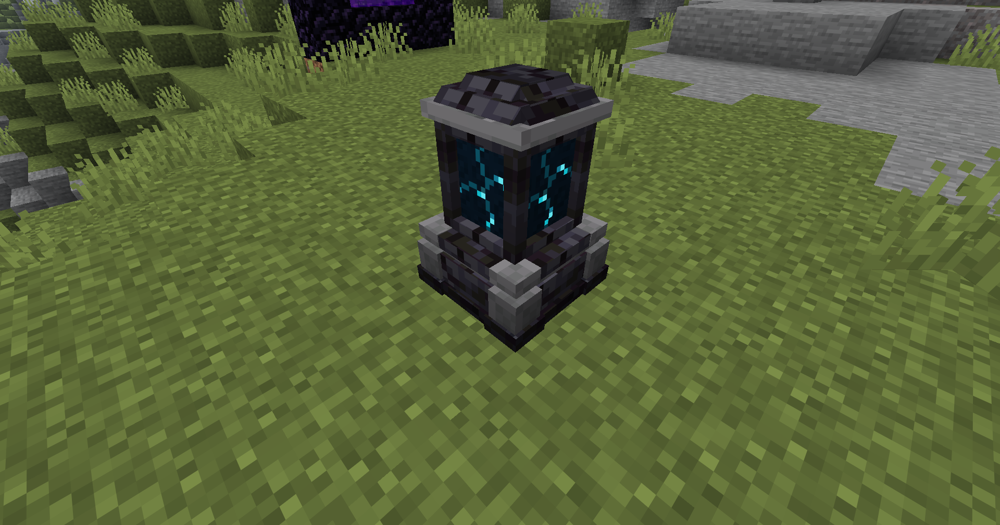
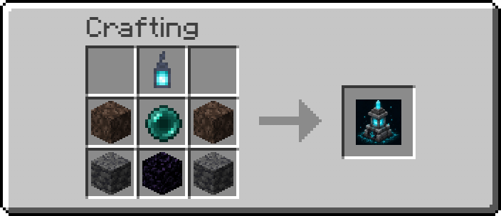

<div align="center">



# Soul Anchor

A personal teleport plugin for HaoHan SMP, built around physical Soul Anchors with limits and survival-friendly costs.

[](https://www.minecraft.net/)
[](https://papermc.io/)
[](https://purpurmc.org/)
[](https://openjdk.org/)
[](https://maven.apache.org/)

Language: [Tiếng Việt](README.md) | English

</div>

## Overview

Soul Anchor is a Minecraft plugin for Paper/Purpur `1.21.11` survival servers. It lets players place private Soul Anchors in the world, open a GUI to choose destinations, and teleport with clear costs instead of behaving like a free `/home` command.

Each Soul Anchor is a physical teleport point. Players must interact with an anchor to open their own teleport network, then choose another owned anchor as the destination. By default, each player may own up to `3` Soul Anchors.

## Tech Stack

| Toolkit | Role |
| --- | --- |
| Paper API | Main server plugin API. |
| Purpur | Recommended server runtime. |
| Java 21 | Main language and runtime. |
| Maven | Dependency management and jar build. |
| Resource Pack | Custom Soul Anchor model and textures. |

## Project Components

| Component | Description |
| --- | --- |
| Plugin | Paper/Purpur plugin source in `src/`, handling items, anchors, GUI, teleport, commands, and config. |
| Resource pack (`rsp`) | Resource pack source used to render the custom Soul Anchor model and textures. |

## Features

- Default limit of `3` Soul Anchors per player.
- 27-slot GUI with the three anchor positions centered.
- Anchor owners can grant teleport access with `/soulanchor share <anchor> <player>`.
- Shared anchors count toward the recipient's same limit; by default, owned and shared anchors combined cannot exceed `3`.
- Teleport warmup, cooldown, and safe-location checks.
- Destination search prefers a safe block beside the target Soul Anchor.
- Default requirement: `10 levels / 1000 blocks`; travel up to `2,000 blocks` costs no Echo Shard.
- Travel beyond `2,000 blocks` costs a fixed `1 Echo Shard`.
- Fishing has a `1% + 0.25%` chance per Luck of the Sea level to yield an Echo Shard, with no attempt limit.
- A Warden killed by a player has a `15%` chance to drop one additional Echo Shard.
- Actual XP charge: `8 XP points` per required level; required levels are only an eligibility threshold.
- Cross-dimension travel requires `30 levels` + `1 Echo Shard` and uses the same XP charge formula.
- Anchor data persists in `plugins/SoulAnchor/anchors.yml`.
- Only the player who placed an anchor can break it; shared users and other players cannot.
- Resource pack support for a custom Soul Anchor model.

Examples when the player starts at exactly the required level with an empty XP progress bar:

| Distance | Required level | Actual XP charge | Echo Shard | Remaining level |
| --- | ---: | ---: | ---: | ---: |
| Up to 1,000 blocks | 10 | 80 XP | 0 | 6 |
| Up to 2,000 blocks | 20 | 160 XP | 0 | 16 |
| Up to 3,000 blocks | 30 | 240 XP | 1 | 27 |
| Up to 4,000 blocks | 40 | 320 XP | 1 | 38 |
| Up to 5,000 blocks | 50 | 400 XP | 1 | 48 |

Later tiers use the same formula: the required level increases by `10` per `1,000 blocks`, while the actual charge is `required level × 8` XP points. The remaining level can differ when the player starts with a higher level or existing XP progress.

## Requirements

- Paper or Purpur `1.21.11`.
- Java `21`.
- Maven if building from source.
- Soul Anchor resource pack for the custom model.

## Installation

1. Build or download the plugin jar.
2. Copy the jar into the server `plugins/` folder.
3. Install the Soul Anchor resource pack for clients or configure it on the server.
4. Restart the server.
5. Craft a Soul Anchor or use `/soulanchor give <player> [amount]`.

## Resource Pack

The resource pack is required for the custom Soul Anchor model. Without it, the item or world model may render incorrectly or appear as a purple-black missing texture.

Local resource pack build output:

```text
target/anchor_spawn_point_fixed.zip
```

After replacing the pack, reload resources with `F3 + T` or restart the game.

## Recipe



Crafts `1x Soul Anchor` using Soul Lantern, Soul Sand, Ender Pearl, Deepslate, and Obsidian. The recipe can be enabled or disabled in `config.yml` with `recipe.enabled`.

## Usage

1. Place a Soul Anchor in the world.
2. Right click the Soul Anchor to open the GUI.
3. Choose a destination anchor in the Soul Anchor network.
4. Wait for warmup to finish.
5. The plugin rechecks anchor state, safe destination, and cost.
6. The player is teleported to a safe block beside the destination anchor.

Teleport is cancelled if the player moves too far, takes damage, deals damage, dies, or logs out during warmup.

## Commands

| Command | Description |
| --- | --- |
| `/soulanchor` | Shows your anchor list. |
| `/soulanchor list` | Shows your anchor list. |
| `/soulanchor list <player>` | Lets admins view another player's anchors. |
| `/soulanchor give <player> [amount]` | Gives Soul Anchors to a player. |
| `/soulanchor rename <anchor> <new-name>` | Renames an owned anchor; anchor names and new names may contain spaces. |
| `/soulanchor share <anchor> <player>` | Shares your anchor with an online player. Anchor names may contain spaces. |
| `/soulanchor reload` | Reloads config and recipe. |

Alias:

```text
/sa
```

## Permissions

| Permission | Default | Description |
| --- | --- | --- |
| `soulanchor.use` | true | Allows GUI and teleport use. |
| `soulanchor.place` | true | Allows placing Soul Anchors. |
| `soulanchor.break.own` | true | Allows breaking owned anchors. |
| `soulanchor.rename` | true | Allows renaming anchors. |
| `soulanchor.share` | true | Allows sharing owned anchors with other players. |
| `soulanchor.admin` | op | General admin permission. |
| `soulanchor.admin.give` | op | Allows the give command. |
| `soulanchor.admin.reload` | op | Allows config reloads. |
| `soulanchor.bypass.cost` | op | Bypasses teleport cost. |
| `soulanchor.bypass.cooldown` | op | Bypasses cooldown. |
| `soulanchor.bypass.warmup` | op | Bypasses warmup. |
| `soulanchor.limit.unlimited` | false | Removes the anchor limit. |

Permission-based limits such as `soulanchor.limit.5` or `soulanchor.limit.10` are also supported.

## Configuration

Config file:

```text
plugins/SoulAnchor/config.yml
```

Important keys:

| Key | Default | Description |
| --- | --- | --- |
| `limits.default` | `3` | Default anchors per player. |
| `item.id` | `haohansmp:soul_anchor` | Internal ID and item model. |
| `item.material` | `BARRIER` | Base item used for crafting/giving; the custom model uses `item.item-model`. |
| `item.placed-block` | `BARRIER` | Placeholder block used after placement. |
| `distance.blocks-per-tier` | `1000` | Blocks per cost tier. |
| `distance.levels-per-tier` | `10` | Levels per tier. |
| `teleport.echo-shard-cost` | `1` | Echo Shard charge beyond the free-distance threshold. |
| `teleport.echo-shard-free-distance` | `2000` | Maximum distance that costs no Echo Shard. |
| `teleport.experience-points-per-required-level` | `8` | Actual XP points charged per required level. |
| `echo-shard-sources.fishing.base-chance` | `0.01` | Echo Shard fishing chance without Luck of the Sea. |
| `echo-shard-sources.fishing.luck-bonus-per-level` | `0.0025` | Additional chance per Luck of the Sea level. |
| `echo-shard-sources.warden.drop-chance` | `0.15` | Chance for a player-killed Warden to drop an Echo Shard. |
| `teleport.warmup-seconds` | `3` | Warmup duration. |
| `teleport.cooldown-seconds` | `30` | Cooldown after teleport. |
| `cross-dimension.level-cost` | `30` | Required level for cross-dimension teleport. |

## Build From Source

Run from the project root:

```bash
mvn clean package
```

Maven jar output:

```text
target/soul-anchor-1.0.3.jar
```

The local workspace may also contain:

```text
target/soul-anchor-1.0.3.jar
target/anchor_spawn_point_fixed.zip
```

## Operation Notes

- When updating the model, replace both the plugin jar and resource pack.
- If old items still render incorrectly, get a fresh item with `/soulanchor give` after the new jar is running.
- `rsp/` is local resource-pack source and should not be pushed unless intentionally needed.
